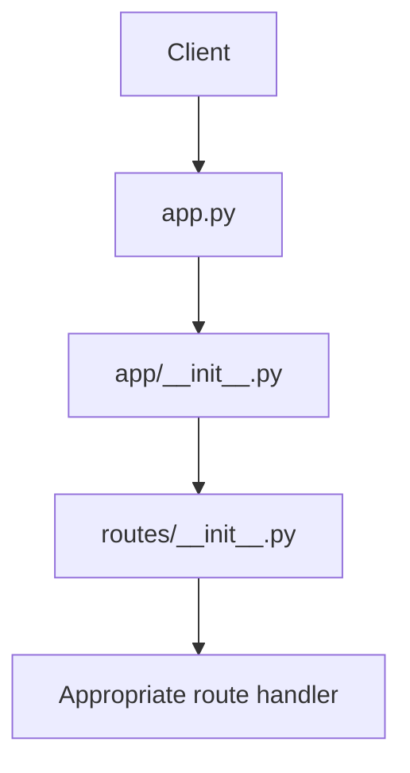
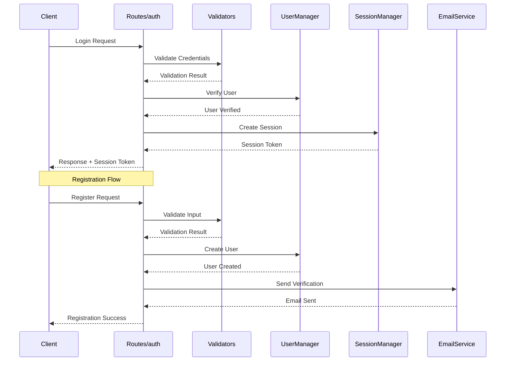
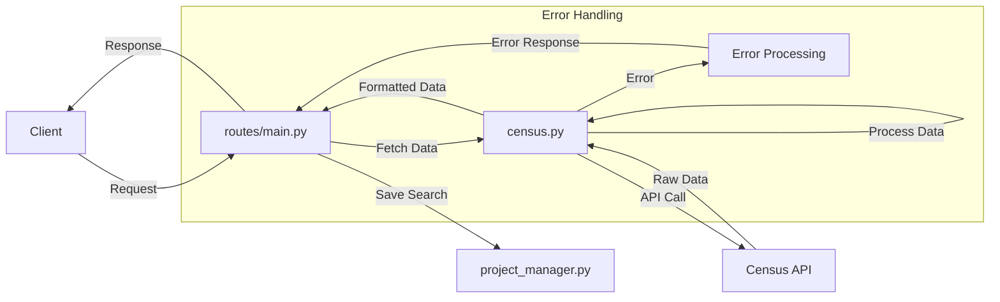

# Backend Component Interaction Documentation

This document details how components in the backend system interact to handle requests and operations, complementing the structural organization defined in the backend structure documentation.

## Table of Contents
- [System Overview](#system-overview)
- [Component Interactions](#component-interactions)
    - [Core Application Flow](#core-application-flow)
    - [Authentication Flows](#authentication-flows)
    - [Data Operation Flows](#data-operation-flows)
    - [Email Service Interactions](#email-service-interactions)
- [Component Dependencies](#component-dependencies)
- [Security Implementation](#security-implementation)
- [Best Practices](#best-practices)

## System Overview

The system follows a layered architecture with clear separation of concerns:

```
Client Request
    ↓
app.py (Entry Point)
    ↓
routes/ (Request Handling)
    ↓
services/ (Business Logic)
    ↓
database/ (Data Persistence)
```

## Component Interactions

### Core Application Flow

1. **Initial Request Processing**:
```
Client → app.py
    → app/__init__.py (Flask app factory)
    → routes/__init__.py (Blueprint registration)
    → Appropriate route handler
```
#### Visual Representation



2. **Database Operations**:
```
Route Handler → db_manager.py (Main interface)
    → Appropriate specialized manager (user/session/security/project)
    → base_manager.py (Connection handling)
    → Database
```

### Authentication Flows

1. **User Registration**:
```
Client → routes/auth/register.py
    → auth/validators.py (Input validation)
    → services/email.py (Verification email)
    → database/managers/user_manager.py (Account creation)
```

#### Visual Representation



2. **User Login**:
```
Client → routes/auth/login.py
    → auth/validators.py
    → database/managers/security_manager.py (Rate limiting)
    → database/managers/user_manager.py (Credential verification)
    → database/managers/session_manager.py (Session creation)
```

3. **Password Reset**:
```
Client → routes/auth/password.py
    → auth/validators.py
    → database/managers/user_manager.py
    → services/email.py (Reset email)
```

### Data Operation Flows

1. **Census Data Retrieval**:
```
Client → routes/main.py
    → services/census.py
        → API call handling
        → Data formatting
        → Error handling
    → database/managers/project_manager.py (Search history)
```
#### Visual Representation


2. **Project Management**:
```
Client → routes/main.py
    → database/managers/session_manager.py (Auth check)
    → database/managers/project_manager.py
        → Project CRUD operations
        → Search history tracking
        → AI interaction logging
```

### Email Service Interactions

The email service (`services/email.py`) integrates with various components:

1. **Account Verification**:
```
register.py → email.py → SMTP Service
    → Template rendering
    → Verification token creation
    → Email sending
```

2. **Password Reset**:
```
password.py → email.py → SMTP Service
    → Reset token generation
    → Template processing
    → Secure email delivery
```

## Component Dependencies

### Database Manager Hierarchy
```
base_manager.py (Base class)
    ↓
security_manager.py
    ↓
user_manager.py
session_manager.py
project_manager.py
    ↓
db_manager.py (Combines all managers)
```

### Service Dependencies
- `census.py`:
    - External Census API
    - Error handling utilities
    - Data formatting tools

- `email.py`:
    - SMTP configuration
    - Email templates
    - Token generation utilities

### Route Dependencies
- `auth/*.py`:
    - validators.py
    - user_manager.py
    - session_manager.py
    - email.py

- `main.py`:
    - census.py
    - project_manager.py
    - session_manager.py

## Security Implementation

1. **Request Validation**:
- All inputs validated by `validators.py`
- Rate limiting via `security_manager.py`
- Session verification through `session_manager.py`

2. **Database Security**:
- Parameterized queries in all managers
- Transaction management in `base_manager.py`
- Security logging in `security_manager.py`

3. **Authentication Security**:
- Password hashing in `user_manager.py`
- Session token management in `session_manager.py`
- Rate limiting in `security_manager.py`

## Best Practices

1. **Error Handling**:
```python
try:
    # Operation specific code
except SpecificException:
    # Handle in appropriate manager
    # Log error
    # Return meaningful response
```

2. **Database Connections**:
```python
with self.get_connection() as conn:
    with conn.cursor() as cur:
        # Perform database operations
```

3. **Input Validation**:
```python
# In validators.py
is_valid, error = validate_input(data)
if not is_valid:
    return error_response(error)
```

4. **Security Checks**:
```python
# In routes
if not security_manager.check_rate_limit(ip_address, endpoint):
    return rate_limit_response()
```

